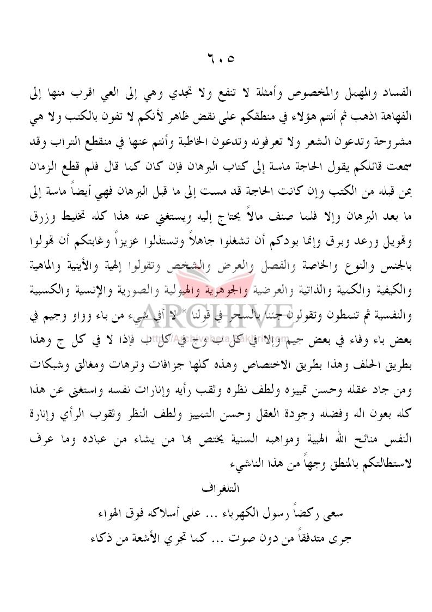
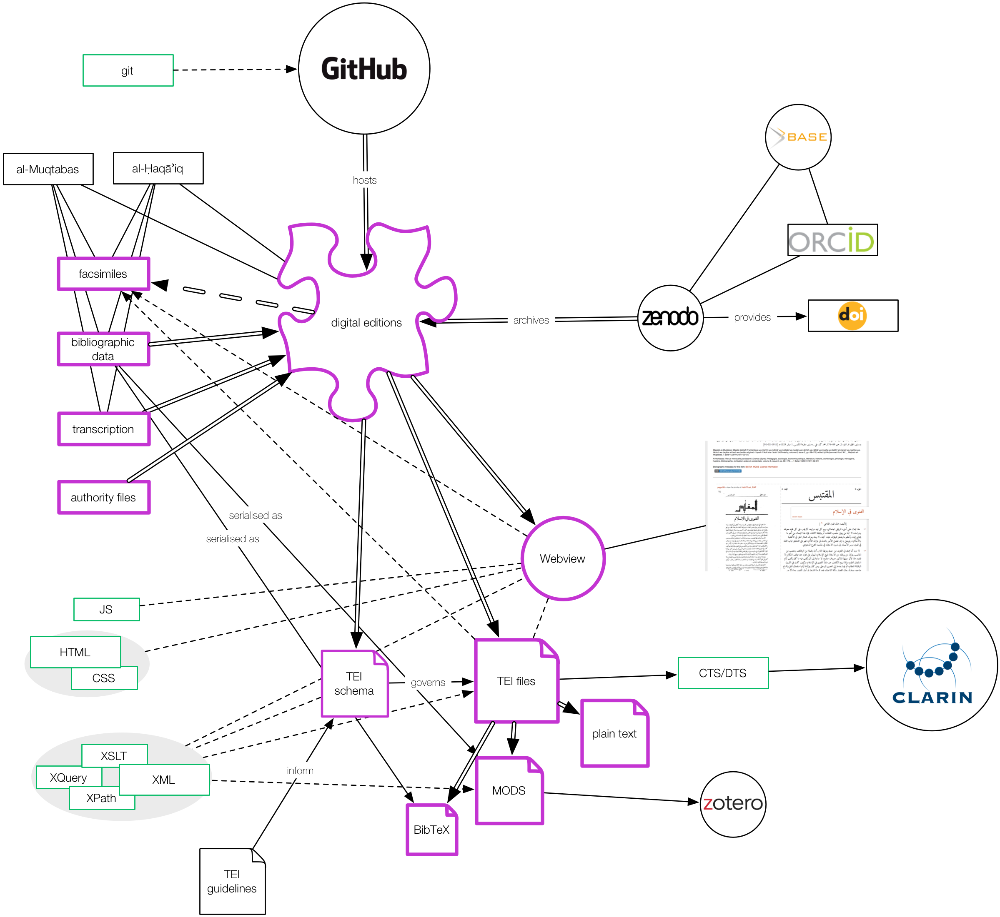
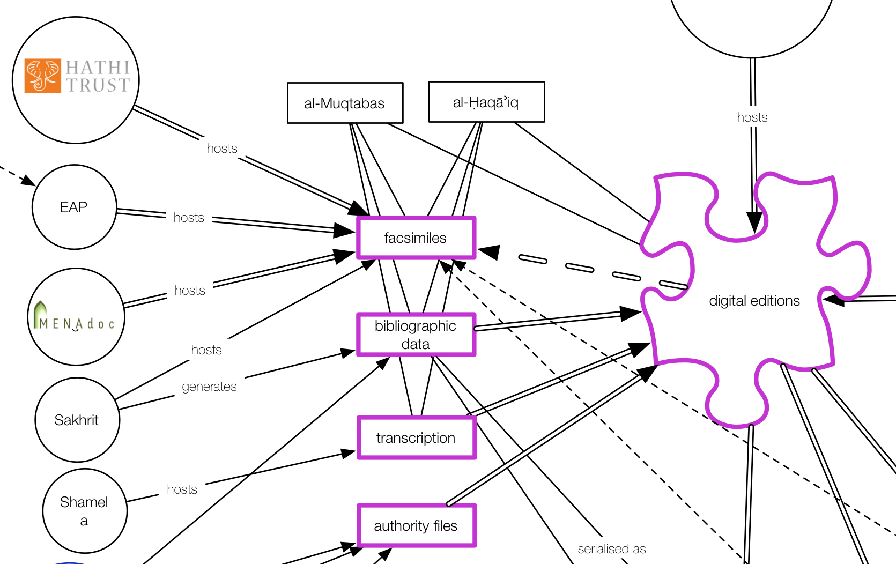
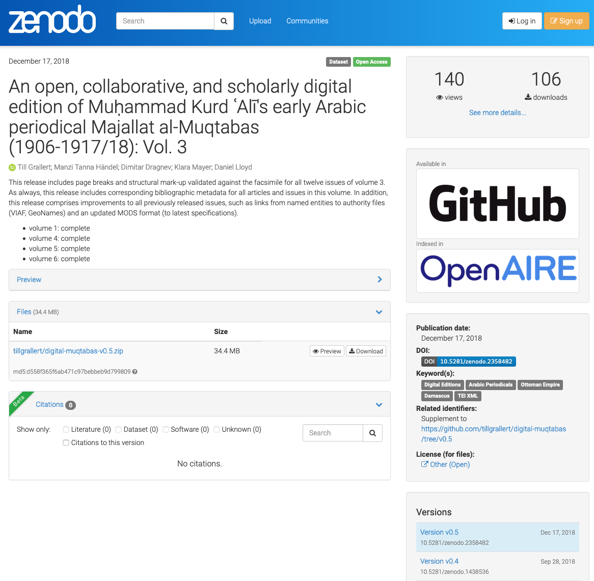

## Open Arabic Periodical Editions: a framework for bootstrapped scholarly editions outside the global north

Till Grallert, Orient-Institut Beirut (OIB)

15 December 2018, Amsterdam

Slides: [https://OpenArabicPE.github.io/slides/2018-amsterdam/](https://OpenArabicPE.github.io/slides/2018-amsterdam/index.html)

## Islamicate DH?

<!-- we are scholars / projects working on Islamicate societies and their cultural production under the constrains and with the  affordances of the anglo-american hegemony over academe -->

](../assets/maps/map_dhcenters.png)

## Outline of today's paper

1. The promised wasteland of *digitised* Arabic periodicals
2. OpenArabicPE: Bootstrapped *digital* editions
    - components
    - features
    - legality

# 1. The promised wasteland of *digitised* Arabic periodicals
## 1.1 Importance of mundane texts / periodicals

<!-- add core questions of today's presentation  -->

- They are at the core of various discourses
    + Modernity / -ism at the end of empire
    + Arabic renaissance
    + Arab nationalism
    + Islamic reform movement
- They form large corpora with an equal distribution along a temporal axis (*al-Muqtabas*: 12 yrs, *al-Manār*: 43 yrs, *al-Muqtaṭaf*: 76 yrs)
    + linguistic analysis
    + historical semantics
    + rich data sets for social history

## 1.2 A two-fold problem

- Preservation: 
    + Active **destruction** of cultural artefacts: iconoclasm, neoliberalism
    + **Decay** through neglect: fragile materiality
- Access:
    + Absence / destruction of infrastructure / channels of knowledge transmission: lack of access to institutions, hardware, software, internet connections
    + widely-dispersed collections
    + technologies: absence of reliable OCR
    <!-- + technical skills: lack of basic scripting skills -->

## 1.3 Digitisation as solution

1. Promise: instant **access** to 100s of **digitised** periodicals and 100.000s of issues
2. Expectations: answers to core questions
    - extent of text re-use
    - identify authors
    - track authors across periodicals
2. Reality
    - limited access
    - limited data
    - limited metadata

## 1.3 Digitisation as problem(s)
<!-- elaborate the problems:-->

1. get the data: **labour and resource intensive**
    - text: transcription
        - OCR and HTR are still insufficient
        - require ground truth and extensive training
    - facsimiles: scanning
        + copyright
        + amount of data
    - bibliographic metadata: 
2. transform the data into a human and machine readable edition: **labour and resource intensive**
    - model the source 
    - identify entities and link them to authority files
3. host, share and preserve the data: **labour and resource intensive**

<!-- the following slides are too detailed for many purposes -->

## 1.4.1 state of digitisation: text

- "crowd"-sourced transcriptions / gray online libraries, e.g. [*al-Maktaba al-Shāmila*](http://shamela.ws/index.php/book/26523), [*Mishkāt*](http://almeshkat.net/), [*Ṣayd al-Fawāʾid*](http://saaid.net/), [*al-Waraq*](http://www.alwaraq.net/) etc.
    + lack of / faulty metadata
    + unknown editing principles
    + unknown quality
    + very limited structural mark-up
    + cannot be reliably cited 
- OCR layer at HathiTrust

## 1.4.1 state of digitisation: text

<!-- ](../assets/shamela_muqtabas-1.png) -->

](../assets/shamela_muqtabas-annotated.png)

## 1.4.1 state of digitisation: text

](../assets/hathi_muqtabas-ocr-2.png)

## 1.4.2 state of digitisation: facsimiles

Digital imagery, e.g. [Endangered Archives Programme (EAP)](http://eap.bl.uk/project/EAP119), [HathiTrust](http://catalog.hathitrust.org/Record/100658549), [*arshīf al-majallāt al-adabiyya wa-l-thaqafiyya al-ʿarabiyya* (sakhrit)](http://archive.sakhrit.co/newmagazineYears.aspx?MID=125)

+ lack of metadata
+ limited licences, paywalls
+ no or very bad text layers

## 1.4.2 state of digitisation: facsimiles

](../assets/eap119-1-4-5-muqtabas-iiif.png)

## 1.4.2 state of digitisation: facsimiles

](../assets/hathi_muqtabas-1.png)

## 1.4.2 state of digitisation: facsimiles

](../assets/hathi_muqtabas-2.png)

## 1.4.2 state of digitisation: fake facsimiles

<!-- original facsimile: [EAP](http://images.eap.bl.uk/EAP119/EAP119_1_4_4/463.jp2/full/800,/0/gray.jpg) -->

*al-Muqtabas* 5(7), pp.[463](https://rawgit.com/tillgrallert/digital-muqtabas/master/xml/oclc_4770057679-i_54.TEIP5.xml#pb_61.d1e2036)--[466](https://rawgit.com/tillgrallert/digital-muqtabas/master/xml/oclc_4770057679-i_54.TEIP5.xml#pb_64.d1e2045)

<!-- shamela's transcription -->

<!-- sakhrit's fake facsimile -->

## 1.4.3 state of digitisation: bibliographic metadata

- needs: 
    + reliable bibliographic metadata on the article level
    + across periodicals
- reality:
    + no platform serving machine-actionable bibliographic metadata below the item level

## 1.4.3 state of digitisation: bibliographic metadata

](../assets/eap119-1-4-5-muqtabas-iiif-metadata.png)

# 2. Open Arabic Periodical Editions (OpenArabicPE): Overview<!-- : Unite facsimile and transcription and generate reliable metadata -->
## 2.1 Aims and principles

1. ideas: 
    - unite **available** facsimiles and transcriptions
    - harvest, generate, validate and share open metadata
2. aims
    + **validate** the transcription against the facsimiles
    - **improve** the transcription with the help of the "crowd"
    - make everything **citable** for scholars, **linkable** for machines
    - share all data, metadata and tools with the broadest possible licences to facilitate access and re-use 
3. principles
    - re-purpose **available** and **established** tools, technologies, and material
    - preference for **open** and **simple** formats and tools

## 2.2 Deliverables: basic components

1. XML/TEI editions with their own [schema for Arabic periodicals](https://github.com/OpenArabicPE/OpenArabicPE_ODD)
    + text links to open-access digital facsimiles
2. Structured bibliographic metadata (MODS, BibTeX)
    + based on XML editions
    + scraped from the web and validated
    + generated
3. Scripts to
    + scrape full text / bibliographic information from the web
    + convert scraped information into TEI, MODS, BibTeX
    + generate bibliographic through iteration
    + improve the TEI mark-up

## 2.2 Deliverables: Core features

1. Open licences: [CC BY-SA 4.0](http://creativecommons.org/licenses/by-sa/4.0/) (TEI, MODS, BibTeX), MIT license (XSLT, XQuery)
1. Social digital editions hosted on [GitHub](https://github.com): gradually improve transcription and mark-up
2. Releases are archived at [Zenodo](https://zenodo.org): receive a DOI for reliable citation
3. [Static web-view](https://github.com/tillgrallert/tei-boilerplate-arabic-editions)<!--  (doesn't require a permanent internet connection) -->: provides side-by-side view of facsimiles and text
4. Access to bibliographic metadata through a public [Zotero group](https://www.zotero.org/groups/openarabicpe)

<!-- mention: process of cleaning data and disambiguation of entities -->

<!-- ](../assets/boilerplate_muqtabas.png) -->

## 2.3 Summary

# 3. OpenArabicPE: some details
## 3. The corpus

### *al-Muqtabas*, 1906--1917/18

|         token          |   total   |  author |
|------------------------|-----------|---------|
| volumes                | 9         |         |
| issues                 | 96        |         |
| pages                  | c.7,000   |         |
| articles (total)       | 2,737     | 323     |
| articles (independent) | 717       | 284     |
| words                  | 1,953,952 | 625,333 |

### *al-Ḥaqāʾiq*, 1910--1913/14

|  token   |  total  | author |
|----------|---------|--------|
| volumes  | 3       |        |
| issues   | 36      |        |
| pages    | 1,446   |        |
| articles | 360     | 76     |
| words    | 300,186 | 40,868 |

## 3. Basic components and features

## 3.1 Components: Generate a TEI edition

- scrape the [digital text from *shamela.ws*](http://shamela.ws/index.php/book/26523)
- transform it into [TEI XML](http://www.tei-c.org): semi-automatically (mostly XSLT)
    + documented URI design to reference all elements
- add structural mark-up (sections, articles, heads, authors ...): semi-automatically
- link to digital facsimiles from the [British Library's "Endangered Archives Programme" (EAP)](http://eap.bl.uk/database/overview_item.a4d?catId=809;r=12316) and [HathiTrust](http://catalog.hathitrust.org/Record/100658549) or produce your own imagery: semi-automatically (mostly manually)
- host everything but images on [GitHub](https://www.github.com)
    + distributed version control
    + attribution of authorship
- provide a [CC BY-SA 4.0 licence](http://creativecommons.org/licenses/by-sa/4.0/) for all files

<!--  edit bullet point on licences -->

## 3.1 Basis: TEI files

~~~{.xml}
<text xml:id="text" xml:lang="ar" type="issue" n="i62">
    <pb ed="print" n="177" facs="#facs_181" xml:id="pb_2.d1e1489"/>
    <front xml:lang="ar" xml:id="front_1.d1e1431">
         

            <bibl>
               <tei:biblScope unit="issue" n="3">الجزء 3</tei:biblScope>
               <tei:biblScope unit="volume" n="6">المجلد 6</tei:biblScope><lb/>
               <title level="j" xml:lang="ar">المقتبس</title>
            </bibl>
         

    </front>
    <body xml:id="body_1.d1e1485" xml:lang="ar">
        <pb corresp="file:../epub/26523/OEBPS/xhtml/P4092.xhtml" ed="shamela" n="n62-p1" xml:id="pb_1.d1e1487"/>
        

            <head xml:id="head_1.d1e1493" xml:lang="ar">الفتوى في الإسلام</head>
            
تابع ل <ref target="oclc_4770057679-i_61.TEIP5.xml#div_2.d1e1517" xml:id="ref_5.d1e1694">ما في الجزء الماضي</ref>

            

                <head xml:id="head_2.d1e1501" xml:lang="ar">آداب المستفتي وصفته وأحكامه</head>
                

                    <head xml:id="head_3.d1e1506" xml:lang="ar">الأول</head>
                    
المستفتي كل من لم يبلغ درجة المفتي فهو فيما يسأل عنه من الأحكام الشرعية مستفت بتقليد من نفسه.

                    
والمختار في التقليد أنه قبول قول من يجوز عليه الإصرار على الخطاء بغير حجة على عين ما قبل قوله فيه.

                    
ويجب عليه الاستفتاء إذا نزلت به حادثة يجب عليه علم حكمها.

                    
فإن لم يجد ببلده من يستفتيه وجب عليه الرحيل إلى من يفتيه وإن بعدت داره وقد رحل خلائق من السلف في المسألة الواحدة الأيام والليالي.

                

            

        

    </body>
</text>
~~~

<!--
## 3.1 Basis: TEI files

 

-->

## 3.1 Basis: Is this legal?

## 3.1 Basis: Is this legal?

Copyright depends on the jurisdiction of creators, distributors, etc.

1. text of *al-Muqtabas*
    + is in the **public domain**: transcription and imaging is **legal**.^[even in the US as attested to by HathiTrust]
    + the transcribers do not / cannot claim copyright: copying is **legal**
2. images of *al-Muqtabas*
    + digital files are protected by copyright: use is subject to licence, linking is **legal**
    + download and redistribution: almost certainly **illegal**
3. digital edition of *al-Muqtabas*
    + all our work is licenced as [CC BY-SA 4.0](http://creativecommons.org/licenses/by-sa/4.0/)

## 3.2 Core feature: Continuous improvement

1. Improvements depending on human labour (probably a "crowd")
    - correct the transcription
    - add structural mark-up
    - add semantic mark-up
2. Automatic improvements:
    - provide reliable bibliographic metadata based on the facsimile
    - mark-up of natural entities with link to external reference files (e.g. personal names, toponyms)

## 3.2 Core feature: how to contribute

- Go to [GitHub](https://www.github.com) and register a free account
- **Fork** the edition's repository: [https://www.github.com/tillgrallert/digital-muqtabas](https://www.github.com/tillgrallert/digital-muqtabas)
- Edit the text (XML)
- Send us a **pull request**
- We will review and merge your changes

## 3.3 Core feature: web-view

- *open*, *free of charge*, *client-based*
- Adaptation of the [TEI Boilerplate XSLT stylesheets](http://dcl.slis.indiana.edu/teibp/) to (Arabic) periodical editions
- human-readable and static web-view (either rawgit or gh-pages)
    + generated on-the-fly by the user's browser using XSLT 1 to transform the TEI XML files to HTML.
    + can be run without an internet connection and with local facsimiles.
- parallel display of text and facsimile
    + simple changes to display different facsimiles
- link to metadata on the article level (MODS, BibTeX)
- the code is shared with a [CC BY-SA 4.0 licence](http://creativecommons.org/licenses/by-sa/4.0/) on [GitHub](https://github.com/tillgrallert/tei-boilerplate-arabic-editions)

## 3.3 Core feature: web-view

](../assets/boilerplate_muqtabas.png)

## 3.4 Core feature: Zotero group

": list view](../assets/zotero-group_digital-muqtabas-1.png)

## 3.4 Core feature: Zotero group

": item view](../assets/zotero-group_digital-muqtabas-2.png)

<!-- the following still needs work -->
## 3.5 Core feature: preservation, DOI

- *al-Muqtabas*:  
- *al-Ḥaqāiq*:  

# 4. state of affairs
## 4.1 ongoing work

- Editorial decisions: TEI schema design
    <!-- + TEI is rooted in the western episteme -->
- Editorial work: 
    + mark-up of page breaks (1-2 h per issue)
    + correcting transcriptions
    + add non-Arabic words omitted by *shamela.ws*
    + add footnotes
    + correct publication dates for all issues.
- Web-display:
    + needs some polishing
    + search functions beyond the Zotero group and individual issues (project can be searched on GitHub)
- Scanning:

## 4.2 experiences: simple, fast, sustainable

- Simple technologies and relatively little coding needed: 
    + Initial project set-up took less than four weeks of after-hour labour
- Hosting, collaborative editing, long-term preservation and DOIs are provided free of cost
- Core (but simple) features **cannot** be automated: 
    + all c.7000 page breaks must be manually tagged
    + does **not** require knowledge of XML, TEI or access to more than a syntax-aware text editor.

<!-- - Collaboration in bootstrapped framework with multiple dependencies  -->
    <!-- + it took a part-time intern 4 weeks to tag one volume of 800 pages -->
<!-- - TEI editing 
    - requires some training
    - patchy support of Arabic across operating systems, Java versions -->
   <!--  + We set-up the sister project [Digital Ḥaqāʾiq](https://www.github.com/tillgrallert/digital-haqaiq) as a digital edition of ʿAbd al-Qādir al-Iskandarānī's monthly journal *al-Ḥaqāʾiq* (1910–12, Damascus) in a single day. -->
    <!-- - Muḥammad Rashīd Riḍā's journal *al-Manār* 
        + [full text from shamela](http://shamela.ws/index.php/book/6947): 8605 views
        + [imagery from HathiTrust](http://catalog.hathitrust.org/Record/008882663),[imagery / PDFs from the Internet Archive](https://archive.org/details/almanaralmanar), which are linked from [*al-Maktaba al-Waqfiyya*](http://waqfeya.com/book.php?bid=7374) -->

# 5. Conclusion
## Summary: OpenArabicPE

- open scholarly **digital editions** of [*[Majallat] al-Muqtabas*](https://github.com/tillgrallert/digital-muqtabas) and [*al-Ḥaqāʾiq*](https://github.com/OpenArabicPE/digital-haqaiq) providing
    + TEI XML files (transcription and links to facsimiles)
    + plain text files
    + MODS and BibTeX files for every article
    + customised version of TEI Boilerplate (XSLT and CSS) with stable URLs for every element
- validated open **bibliographic metadata** (MODS) for 
    - [*al-Jinān* (1875--1885)](https://github.com/OpenArabicPE/journal_al-jinan), [*al-Quds* (#1--391, 1908--14)](https://github.com/OpenArabicPE/newspaper_al-quds), [*Ḥadīqat al-Akhbār* (#1--357, 1858--65)](https://github.com/OpenArabicPE/newspaper_hadiqat-al-akhbar), [*Thamarāt al-Funūn* (#1--1695, 1875--1908)](https://github.com/OpenArabicPE/newspaper_thamarat-al-funun) 
- within a framework (git, [GitHub](https://github.com/openarabicpe), [Zenodo](https://zenodo.org/), [Zotero](https://www.zotero.org/groups/openarabicpe/items/)) that allows for / provides
    + collaborative, open, version-controlled improvements
    + re-use of the data, metadata and tools 
    + long-term preservation and DOIs
    + discovery <!-- in CLARIN -->

## Thank you!

- Contributors to OpenArabicPE: Dimitar Dragnev, Talha Güzel, Hans Magne Jaatun, Xaver Kretzschmar, Daniel Lloyd, Klara Mayer, Tobias Sick, Manzi Tanna-Händel and Layla Youssef
- Links:
    + Slides: [https://OpenArabicPE.github.io/slides/2018-turkologentag/](https://OpenArabicPE.github.io/slides/2018-turkologentag/index.html)
    <!-- + Paper (draft): <https://doi.org/10.5281/zenodo.1413610> -->
    + Project URLs: [https://www.github.com/OpenArabicPE](https://www.github.com/OpenArabicPE), [https://www.github.com/tillgrallert/digital-muqtabas](https://www.github.com/tillgrallert/digital-muqtabas), [https://www.github.com/OpenArabicPE/digital-haqaiq](https://www.github.com/OpenArabicPE/digital-haqaiq)
    + Project blog: [https://openarabicpe.github.io](https://openarabicpe.github.io)
    + Twitter: @[tillgrallert](https://twitter.com/tillgrallert)
    + Email: <grallert@orient-institut.org> <till.grallert@fu-berlin.de>
- Licence: slides and images are licenced as [CC BY-SA 4.0](http://creativecommons.org/licenses/by-sa/4.0/)
