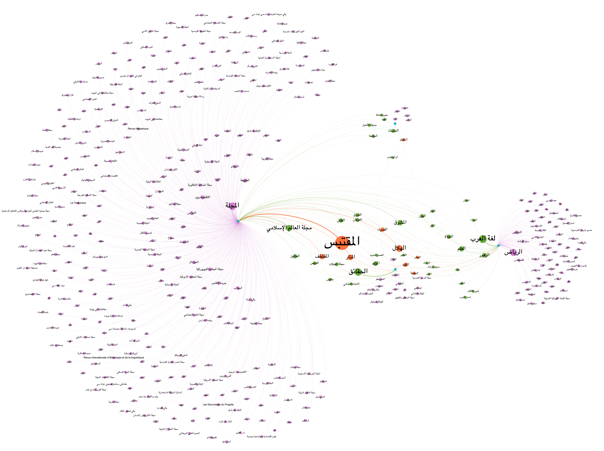
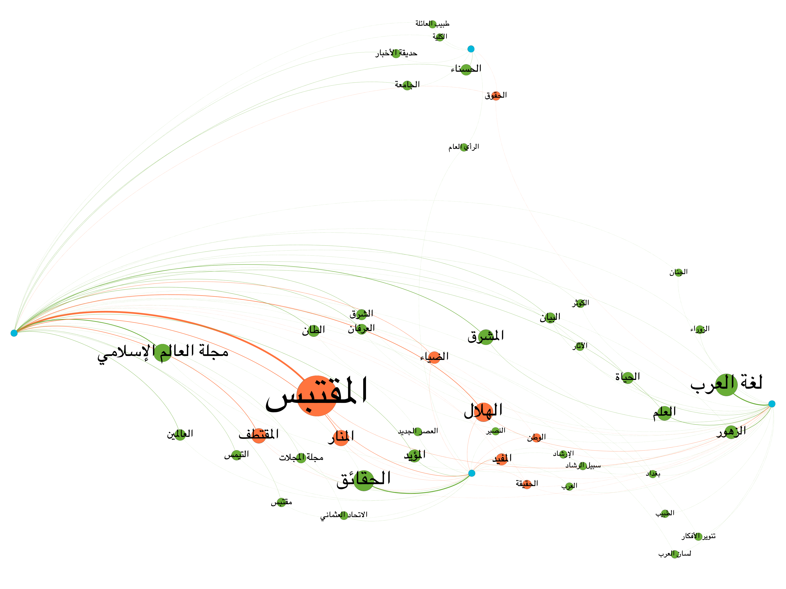
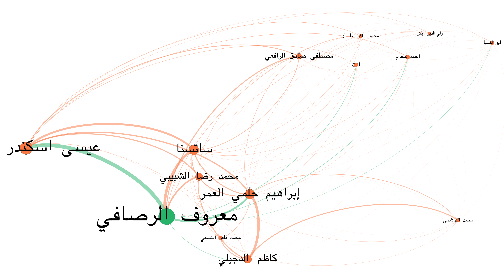
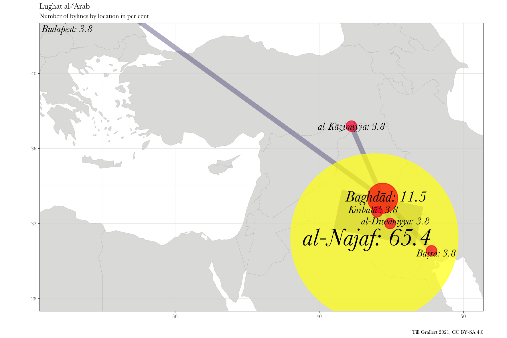
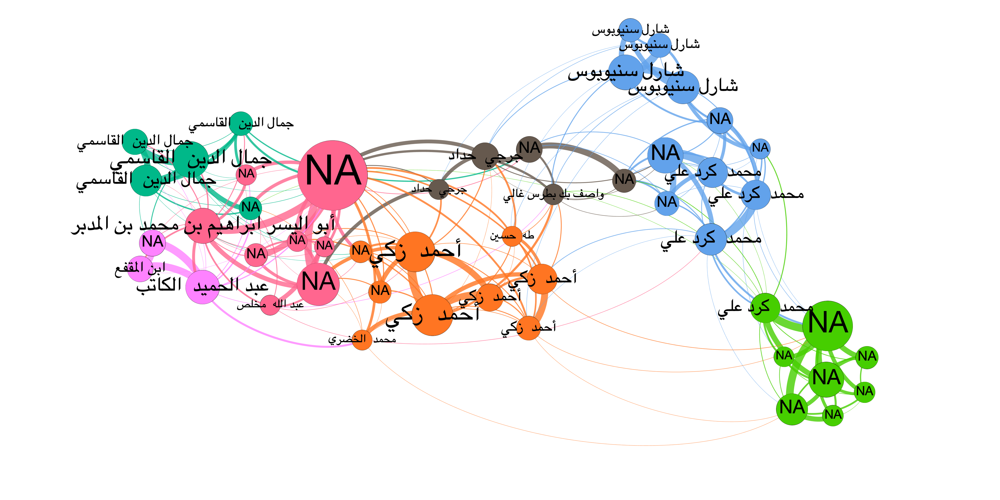
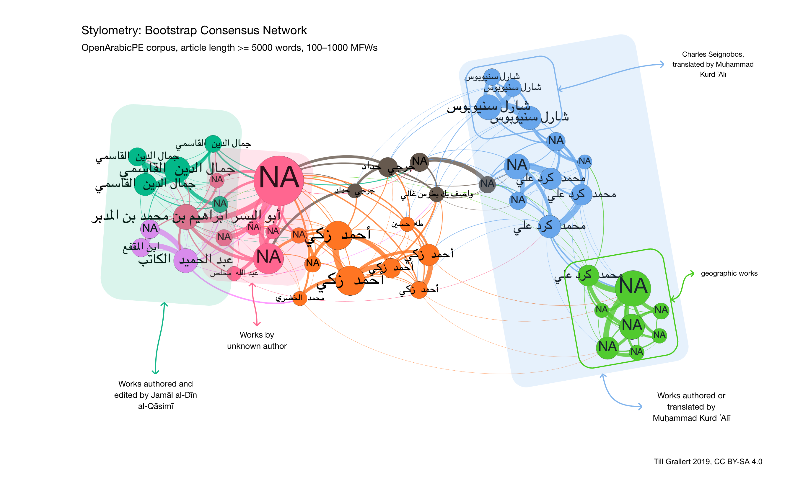
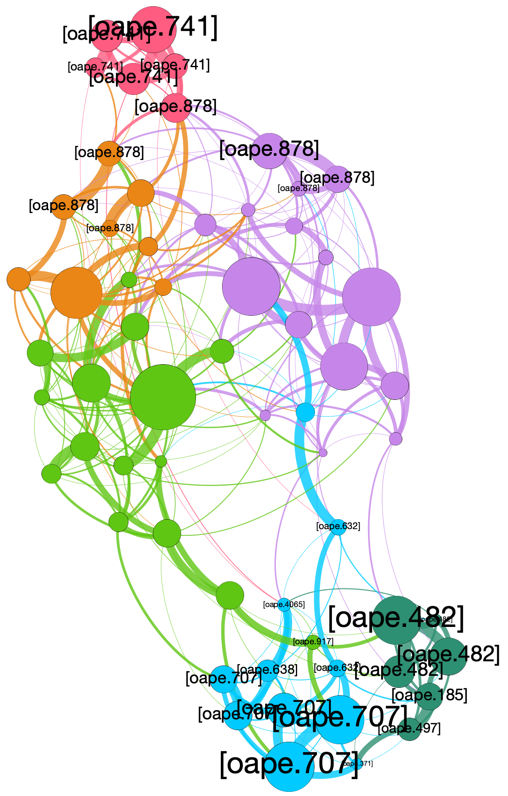
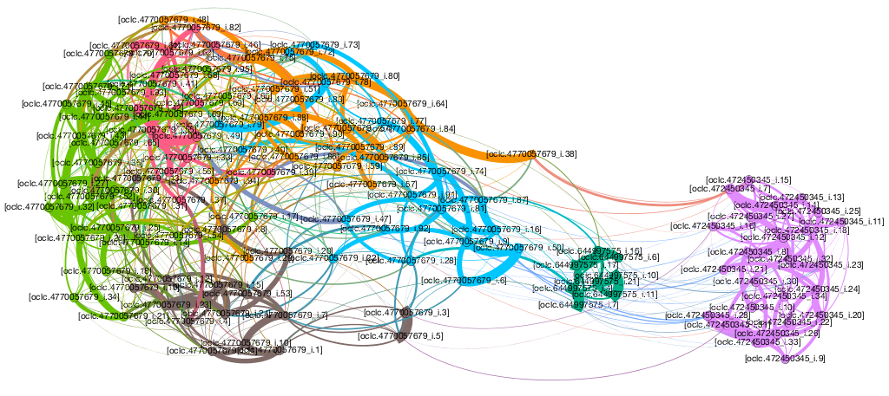

## to do

- conclusion

##  Catch me if you can! Computational approaches to Arabic periodical studies

Till Grallert

OIB Forschungstage 2020

Slides: [https://OpenArabicPE.github.io/slides/2020-oib-forschungstage/](https://OpenArabicPE.github.io/slides/2020-oib-forschungstage/index.html)

# Introduction: me
## academic profile

- academic background: social historian of the late Ottoman Eastern Mediterranean
- PhD: history of the streets as public places and public space in late Ottoman Damascus
- main areas of research:
    + social history
    + conceptual history
    + intellectual history
    + urban studies
    + periodical studies
    + gender studies
    + digital humanities

# Introduction: project
## Outline

- Problematic state of Arabic periodical studies
- Methodologic proposals to computationally address this state
- Three concrete approaches
    + (social) network analysis
    + bibliometrics
    + stylometric authorship attribution

## Problems

1. periodicals are commonly perceived as a **source** but not a **subject** in its own right
2. the history of the periodical press
    + remains largely unexplored
    + is full of untested hypotheses
    + is heavily biased by national(ist) narratives
    + focusses on a few "core" publications from Cairo and Beirut

## One of the many reasons

## Open questions: micro level

- how were individual periodicals produced?
- who authored the vast majority of anonymous articles?
- how to conceptualise "authorship"?

## Open questions: meso level

- What are the core nodes (authors, periodicals, other works) in the ideosphere of the late Ottoman Eastern Mediterranean?

## Open question: macro level

- How do we have to revise the *nahḍa* narrative / late Ottoman intellectual history if we include the full ideosphere of the press beyond Cairo and Beirut?

# Methodology
## Methodology: computational approaches

- *distant reading*
    - bibliometrics
    - social network analysis
    - stylometric authorship attribution
+ requires a digital corpus -> *corpus building*

## corpus building

1. get the data: **labour and resource intensive**
    - text: transcription
    - facsimiles: scanning
    - bibliographic metadata: transcription, validated iterative generation
2. transform the data into a human and machine readable edition: **labour and resource intensive**
    - model the source
    - identify entities and link them to authority files
3. host, share and preserve the data: **labour and resource intensive**

## corpus building: [Open Arabic Periodical Editions](https://github.com/openarabicpe)

1. ideas:
    - unite **available** facsimiles and transcriptions in a standard-compliant format
    - harvest, generate, validate and share open metadata
2. aims
    + **validate** the transcription against the facsimiles
    - **improve** the transcription with the help of the "crowd"
    - make everything **citable** for scholars, **linkable** for machines
    - share all data, metadata and tools with the broadest possible licences to facilitate access and re-use
3. principles
    - re-purpose **available** and **established** tools, technologies, and material
    - preference for **open** and **simple** formats and tools

## corpus building: [Open Arabic Periodical Editions](https://github.com/openarabicpe)

1. Open licences: [CC BY-SA 4.0](http://creativecommons.org/licenses/by-sa/4.0/) (TEI, MODS, BibTeX), MIT license (XSLT, XQuery)
1. Social digital editions hosted on [GitHub](https://github.com): gradually improve transcription and mark-up
2. Releases are archived at [Zenodo](https://zenodo.org): receive a DOI for reliable citation
3. [Static web-view](https://github.com/tillgrallert/tei-boilerplate-arabic-editions)<!--  (doesn't require a permanent internet connection) -->: provides side-by-side view of facsimiles and text
4. Access to bibliographic metadata through a public [Zotero group](https://www.zotero.org/groups/openarabicpe)

## OpenArabicPE's corpus

| title               | volumes | issues | articles | words   | words per article |
| --------            | ----:   | ----:  | ----:    | ----:   | ----:             |
| **al-Ḥaqāʾiq**      | 3       | 35     | 389      | 298090  | 832.66            |
| **al-Ḥasnāʾ**       | 1       | 12     | 201      | NA      | NA                |
| al-Manār            | 35      | 537    | 4300     | 6144593 | 1437.73           |
| **al-Muqtabas**     | 9       | 96     | 2964     | 1981081 | 873.34            |
| al-Ustādh           | 1       | 42     | 435      | 221447  | 582.21            |
| al-Zuhūr            | 4       | 39     | 436      | 292333  | 695.09            |
| **Lughat al-ʿArab** | 3       | 34     | 939      | 373832  | 485.21            |
| **total**           | 56      | 795    | 9664     | 9311376 |                   |

## OpenArabicPE's corpus

| title               | articles with author (%) | authors | author.birth.avg | author.death.avg |
| -------             | ----:                    | ----:   | ----:            | ----:            |
| **al-Ḥaqāʾiq**      | 41.90                    | 104     | 1837.53          | 1905.93          |
| **al-Ḥasnāʾ**       | 37.31                    | 50      | 1883.14          | 1947.17          |
| al-Manār            | **87.14**                | 356     | 1870.96          | 1913.5           |
| **al-Muqtabas**     | 12.72                    | 140     | 1855.94          | 1929.48          |
| al-Ustādh           | 5.52                     | 8       | NA               | NA               |
| al-Zuhūr            | 41.51                    | 112     | 1872.96          | 1939.52          |
| **Lughat al-ʿArab** | 16.19                    | 53      | 1875.8           | 1942.1           |

# First attempts to computationally map the ideosphere of the late Ottoman Arabic-speaking press
# Evaluating the corpus: network of referenced periodicals
## network of referenced periodicals: data sources

- mark-up of all references to periodicals in the text
    + semi-automatic
    + TEI XML
- authority files for disambiguation and additional information

## network of referenced periodicals

1. only a few nodes are of relative importance
2. *al-Muqtabas* accounts for the vast majority of references
3. all periodicals are primarly self-referential

## network of referenced periodicals: the core

<!-- ## network of referenced periodicals -->

1. confirms the bias on Cairo and Beirut
2. highly centralised in terms of geographic distribution
3. surprising members

# Bibliometrics: the network of authors
## network of authors: data sources

- structured bibliographic data provided by the text itself
    + based on TEI XML
- authority files for disambiguation and additional information

## network of authors

<!-- ## network of authors -->

1. only a few nodes are of relative importance
2. limited overlap between journals from the same city
3. nodes are connected by various other social networks (education, imperial service, family relations etc.)

## network of authors: the core

<!-- ## network of authors -->

1. many Iraqis
2. few Syrians
3. few Christians
2. many poets
3. majority not covered by scholarly literature

## network of authors: geography

## problem: network reflects only 17% of articles

# finally: computational authorship attribution
## state of the field

- question of authorship attribution has not received much attention <!-- standard accounts don't even mention the issue -->
- implicit and commonly accepted hypothesis: editors authored all anonymous articles themselves

## problems:

- hypothesis remains untested
- we don't know the potential candidates for authorship even within the hypothesis
- it is unlikely that a single person authored everything

## computational authorship attribution: stylometry

- this has not yet been applied to Arabic
- method: **compare** stylistic features to gain a numerical measure of difference
    + distance measure is sensitive to composition of corpus
- stylistic features: most frequent words (MFWs)
    + have been shown to be extremely effective for authorship attribution
- chunking/sampling impacts results
    + features: run multiple iterations and have them vote
    + texts: minimum length of 4000-5000 words

## stylometry: 5000 words

## stylometry: 5000 words

## stylometry: 5000 words

- it works! correctly identified signal of
    + authorship
    + editorship
    + translation
- additional (sub)-signal: genre
- Contradicts the hypothesis insofar as there is at least one additional author beyond Muḥammad Kurd ʿAlī for articles in *al-Muqtabas*

## stylometry: how to deal with the minimal length requirement?

- oape.878: Muḥammad Kurd ʿAlī
- oape.741: Charles Seignobos (in translation by Muḥammad Kurd ʿAlī)
- oape.482: Muḥammad Jamāl al-Dīn al-Qāsimī
- oape.707: Aḥmad Zakī Pasha
- oape.632: Jirjī Ḥaddād

## stylometry: how to deal with the minimal length requirement?

# Conclusion
## Thank you!

- Links:
    + Slides: [https://OpenArabicPE.github.io/slides/2020-oib-forschungstage/](https://OpenArabicPE.github.io/slides/2020-oib-forschungstage/index.html)
    + Paper (submitted): <https://doi.org/10.5281/zenodo.1413610>
    + Project URL: [https://www.github.com/OpenArabicPE](https://www.github.com/OpenArabicPE)
    + Project blog: [https://openarabicpe.github.io](https://openarabicpe.github.io)
    + Twitter: @[tillgrallert](https://twitter.com/tillgrallert)
    + Email: <grallert@orient-institut.org>
- Licence: slides and plots are licenced as [CC BY-SA 4.0](http://creativecommons.org/licenses/by-sa/4.0/)