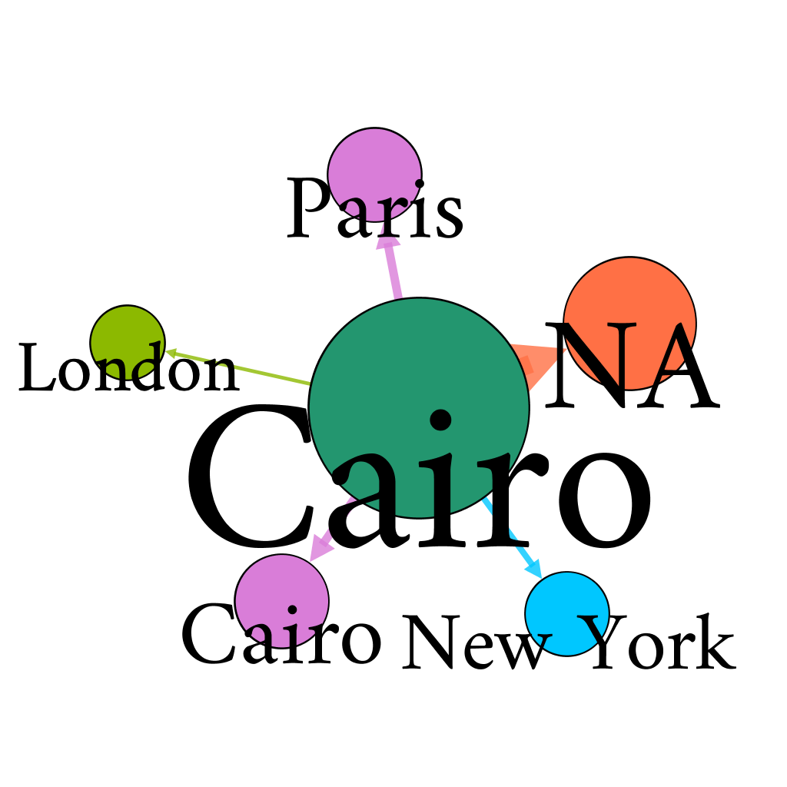
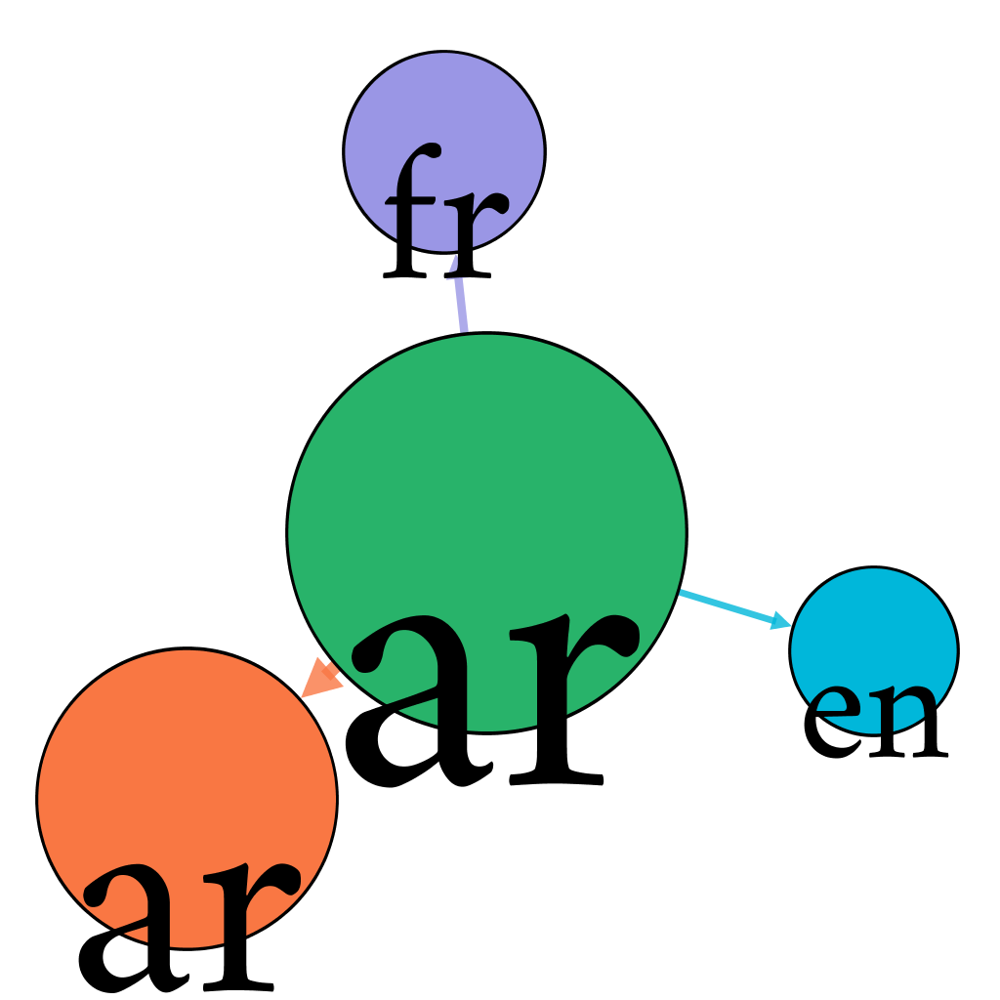
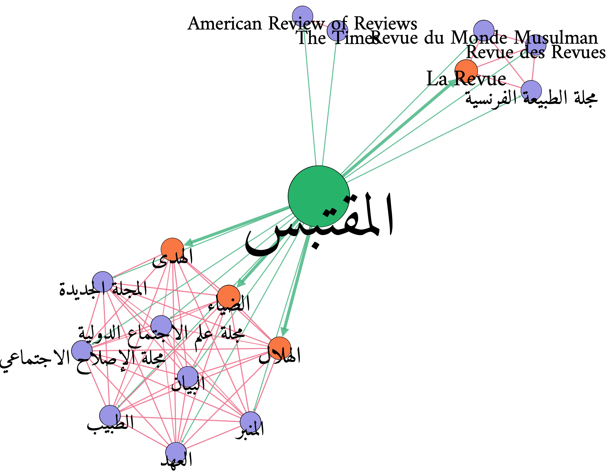

##  Netzwerkanalyse {.titlepage}

Till Grallert, Orient-Institut Beirut (OIB), @[tillgrallert](https://twitter.com/tillgrallert)

18 Januar 2021

Slides: [https://OpenArabicPE.github.io/slides/2021-hamburg/](https://OpenArabicPE.github.io/slides/2021-hamburg/index.html)

## Netzwerkanalyse

<div class="c_width-50 c_left">

What most people think I do


</div><div class="c_width-50 c_right">

What I actually do

1. Daten vorbereiten
    - Digitalisieren
    - Daten modellieren
    - entity recognition
    - entity disambiguation
    - Daten bereinigen
    - ein bisschen mehr Daten bereinigen
    - ...
    - noch mehr Daten bereinigen
2. Netzwerkanalyse
    - Daten transformieren
    - natürlich wieder Daten bereinigen
    - analysieren
    - visualisieren


</div>

# Wer bin ich? Warum bin ich heute hier?
## Hauptinteresse: Sozialgeschichte

Sozialgeschichte des östlichen Mittelmeerraumes in den letzten 250 Jahren

- Geschichte(n) von unten (auch wenn sie häufig "of" below sind), Alltagsgeschichte(n)
    + Annales, Social history workshop (E.P. Thompson, Eric Hobsbawm)
- Geschichten der Devianz, des Lumpenproletariates / dangerous classes / subalterns
- Genealogie öffentlicher Orte als sozialbedingte Kategorie und Performance der Vorstellung von Öffentlichkeit (public space)
    + spätosmanisches Damaskus
- Genealogie sozialer Protesbewegungen:
    + Nahrungsmittelunruhen als Verhandlung sozialer Ordnung im östlichen Mittelmeerraum vom 18. bis 20. Jahrhundert

## abgeleitete Nebeninteressen

- Begriffsgeschichte: Sozialgeschichte ist nicht ohne denkbar. Immer schon alles in Text konstituiert.
    + Öffentlichkeit: als Kernkonzept der Moderne und im Kern vieler sozialen und wissenschaftlichen Debatten über städtisches Leben
- Periodika Studien, Geschichte der Presse, Zensurgeschichte
    + Periodika sind eine meiner Hauptquellen als Sozialhistoriker
    + Presse als Leitmedium der Moderne und Inbegriff der Öffentlichkeit
- Geistesgeschichten, bzw. Intellektuellen-Geschichte
    + Der die Presse bestimmenden Menschen
- Digital Humanities:
    + Computergestützte Verfahren für die Sozial- und Begriffsgeschichte
    + Digitale Remediierung von Quellen: Editionen arabischer Periodika
    + Problematisierung des Digital Divide zwischen dem Globalen Norden und Süden
    + Netzwerkanalysen
    + Stylometrie

# Periodika-Forschung und Netzwerkanalyse
## Beobachtungen

- Forschung ist anekdotisch
- Extremer Fokus auf 2 Orte: Kairo und Beirut
- Meine Lektüre der Periodika aus *Bilād al-Shām* deckt sich nur sehr begrenzt mit der Forschungsliteratur

## Forschungsfragen

- Was sind die wichtigsten Knoten (Autor_innen, Periodika, Orte etc.) im diskursiven Feld der Presse?
- Produktionsgeschichte:
    + Wie wurden Periodika produziert?
    + Wer verfasste die mehrheitlich anonymen Texte?
    + Wie hoch ist die Wiederverwertungsrate und wie "reisten" Texte?
- Rezeptionsgeschichte:
    + Wer hat was, wo und wann gelesen (und darüber geschrieben)?

## Fokus für heute
### Periodika-Netzwerke

- Frage: welche Periodika werden besonders viel rezepiert?
- Wie: wir zählen sämtliche Erwähnungen von Periodika in allen Periodika (wirklich)
- Benötigte Daten:
    - Modellierter, digitaler Volltext mit Auszeichnung von *named entities* (Periodikatitel)
    - Normdatensätze zur Disambiguierung
- Zweck:
    + Erweiterung unseres Wissens über Periodika
    + Überprüfung bestehender Trends in der Forschung
    + Überprüfung der Signifikanz des eigenen Korpus
    + Hilfestellung für zukünftige Digitalisierungsprojekte

## Vorhandene Daten: [Open Arabic Periodical Editions](https://openarabicpe.github.io)

Modellierter Volltext ([TEI XML](http://www.tei-c.org)), bibliographische Metadaten ([MODS](http://www.loc.gov/standards/mods/), [RDF](https://en.wikipedia.org/wiki/Resource_Description_Framework), [BibTeX](http://www.bibtex.org/Format/)), Normdaten ([TEI XML](http://www.tei-c.org))

| periodical                                                                        | doi                                                              | volumes | issues | articles | words   | words per article |
| :--------                                                                         | :--                                                              | ----:   | ----:  | ----:    | ----:   | ----:             |
| [**al-Ḥaqāʾiq**](https://www.github.com/openarabicpe/digital-haqaiq)              | [10.5281/zenodo.1232016](https://doi.org/10.5281/zenodo.1232016) | 3       | 35     | 389      | 298090  | 832.66            |
| [**al-Ḥasnāʾ**](https://www.github.com/openarabicpe/journal_al-hasna)             | [10.5281/zenodo.3556246](https://doi.org/10.5281/zenodo.3556246) | 1       | 12     | 201      | NA      | NA                |
| [al-Manār](https://www.github.com/openarabicpe/journal_al-manar)                  |                                                                  | 35      | 537    | 4300     | 6144593 | 1437.73           |
| [**al-Muqtabas**](https://www.github.com/tillgrallert/digital-muqtabas)           | [10.5281/zenodo.597319](https://doi.org/10.5281/zenodo.597319)   | 9       | 96     | 2964     | 1981081 | 873.34            |
| [al-Ustādh](https://www.github.com/openarabicpe/journal_al-ustadh)                | [10.5281/zenodo.3581028](https://doi.org/10.5281/zenodo.3581028) | 1       | 42     | 435      | 221447  | 582.21            |
| [al-Zuhūr](https://www.github.com/openarabicpe/journal_al-zuhur)                  | [10.5281/zenodo.3580606](https://doi.org/10.5281/zenodo.3580606) | 4       | 39     | 436      | 292333  | 695.09            |
| [**Lughat al-ʿArab**](https://www.github.com/openarabicpe/journal_lughat-al-arab) | [10.5281/zenodo.3514384](https://doi.org/10.5281/zenodo.3514384) | 3       | 34     | 939      | 373832  | 485.21            |
| **total**                                                                         |                                                                  | 56      | 795    | 9664     | 9311376 |                   |

## Vorhandene Daten: [Open Arabic Periodical Editions](https://openarabicpe.github.io)

<div class="c_width-30">

- Modellierter Volltext mit Auszeichnungen ([TEI XML](http://www.tei-c.org))

<!-- <biblStruct>
    <monogr>
        <title level="j" xml:lang="ar">المقتبس</title>
        <editor><persName ref="oape:pers:878 viaf:32272677" xml:lang="ar"> <forename>محمد</forename> <surname>كرد علي</surname> </persName></editor>
        <idno type="oape">9</idno>
        <imprint>
            <pubPlace> <placeName ref="oape:place:226 geon:360630" xml:lang="ar">القاهرة</placeName></pubPlace>
            <date calendar="#cal_islamic" datingMethod="#cal_islamic" when="1907-01-16" when-custom="1324-12-01">1 Jum II 1324</date>
        </imprint>
        <biblScope from="1" to="1" unit="volume"/>
        <biblScope from="12" to="12" unit="issue"/>
        <biblScope from="609" to="672" unit="page"/>
    </monogr>
</biblStruct> -->

```xml
<p xml:lang="ar">هبط مصر في شتاء <date when="1897"> سنة <num value="1897">١٨٩٧</num></date>لإنشاء مجلة علمية وطبع معجم عربي كان عني بتأليفه منذ سنين ولكن خانته الأقدار فرأى ما كان يسمعه عن نهضة مصر العلمية مبالغاً فيه وأن <pb corresp="file:../epub/26523/OEBPS/xhtml/P686.xhtml" ed="shamela" n="n12-p50"/> سوق العلم والأدب كاسدة لا لإقبال عليها فأصدر أولاً <bibl subtype="journal" type="periodical">مجلة <title level="j" ref="oape:bibl:11 oclc:792754974">البيان</title></bibl> سنة بمعاونة <persName ref="oape:pers:2817">الدكتور زلزل</persName> ثم أصدر وحده <bibl subtype="journal" type="periodical">مجلة <title level="j" ref="oape:bibl:27 oclc:1034555409">الضياء</title></bibl> فدامت مطردة الصدور إلى صيف هذه السنة وقد شحنها من عرائس أفكاره وتحقيقاته اللغوية وأماليه الأدبية ما لو كتب بغير هذا اللسان لأعجب به أهله وكبروا مثل مقالات اللغة والعصر ولغة الجرائد وأغلاط العرب وأغلاط المولدين وطبع في العهد الأخير كتاب نجعة الرائد في اللغة ولم يوفق إلى طبع معجمه لأسباب أهمها قلة النصير والظهير.</p>
```

</div>

<div class="c_width-60">

- Normdaten ([TEI XML](http://www.tei-c.org))

```xml
<biblStruct oape:frequency="monthly" subtype="journal" type="periodical">
  <monogr>
        <title level="j" xml:lang="ar">البيان</title>
        <title level="j" type="sub" xml:lang="ar">مجلة علمية أدبية طبية صناعية</title>
        <idno type="oape">11</idno>
        <idno type="jid" xml:lang="ar">161</idno>
        <idno type="OCLC">792754974</idno>
        <editor source="../../oclc_165855925/tei/oclc_165855925-v_1.TEIP5.xml#p_1303.d2e14065" xml:lang="ar"> <persName ref="oape:pers:2808 viaf:64154472"><forename>ابراهيم</forename> <surname><addName type="nisbah">اليازجي</addName></surname></persName> </editor>
        <editor source="../../oclc_165855925/tei/oclc_165855925-v_1.TEIP5.xml#p_1303.d2e14065"><persName ref="oape:pers:2817 viaf:57953733"> <forename>بشارة</forename> <surname>زلزل</surname></persName> </editor>
        <textLang mainLang="ar"/>
        <imprint>
            <date from="1897-03-01" to="1898"/>
            <pubPlace><placeName ref="oape:place:226 geon:360630" xml:lang="ar">القاهرة</placeName></pubPlace>
        </imprint>
        <biblScope from="1" to="1" unit="volume" xml:lang="ar"/>
        <biblScope from="1" to="1" unit="issue" xml:lang="ar"/>
  </monogr>
</biblStruct>
```
</div>
<div class="c_width-60">

```xml
<person>
    <persName xml:lang="ar"><forename>بشارة</forename> <surname>زلزل<surname></persName>
    <persName xml:lang="ar"><roleName type="title">الدكتور</roleName> <surname xml:lang="ar">زلزل</surname></persName>
    <idno type="oape">2817</idno>
    <idno type="VIAF">57953733</idno>
    <death resp="#org_viaf" when="1905">1905</death>
</person>
```

</div>

## Vorhandene Daten: [Project Jarāʾid](https://projectjaraid.github.io)

<div class="c_width-50 c_left">
- Bibliographische Metadaten zu allen (3300+) arabischen Periodika bis 1930 ([TEI XML](http://www.tei-c.org))

```xml
<biblStruct type="periodical">
  <monogr>
     <title level="j" xml:lang="ar-Latn-x-ijmes">Al-Iqbāl</title>
     <title level="j" xml:lang="ar">الاقبال</title>
     <idno type="jaraid">t1r2353</idno>
     <textLang mainLang="ar"/>
     <editor>
        <persName ref="jaraid:pers:1926" xml:lang="ar-Latn-x-ijmes">ʿAbd al-Bāsiṭ al-Unsī</persName>
     </editor>
     <imprint>
        <pubPlace>
           <placeName ref="jaraid:place:2">Beirut</placeName>
        </pubPlace>
        <date type="onset" when="1902-04-09">1902</date>
     </imprint>
  </monogr>
</biblStruct>
```

</div><div class="c_width-50 c_right">

- Normdaten ([TEI XML](http://www.tei-c.org))

```xml
<person>
    <persName xml:lang="ar-Latn-x-ijmes">ʿAbd al-Bāsiṭ al-Unsī</persName>
    <persName xml:lang="ar">عبد الباسط الانسي</persName>
    <idno type="jaraid">1926</idno>
    <idno type="VIAF">22151654727108281690</idno>
    <birth resp="#org_viaf" when="1867">1867</birth>
    <death resp="#org viaf" when="1940">1940</death>
</person>
```

```xml
<place type="town">
    <placeName xml:lang="en">Beirut</placeName>
    <placeName source="#org_geon" xml:lang="ar">بيروت</placeName>
    <placeName source="#org_geon" xml:lang="fr">Beyrouth</placeName>
    <location source="#org_geon">
        <geo>33.88894, 35.49442</geo>
    </location>
    <idno type="jaraid">2</idno>
    <idno type="url">http://en.wikipedia.org/wiki/Beirut</idno>
    <idno type="geon">276781</idno>
</place>
```

</div>

## Benötigte Daten: Knoten und Kanten

Knoten-Tabelle

```csv
"id","name","name.transliterated","type"
"9","المقتبس","al-Muqtabas","periodical"
"11","البيان","al-Bayān","periodical"
"27","الضياء","al-Ḍiyāʾ","periodical"
```

Kanten-Tabelle

```csv
"source","target","date","place","type"
"9","11","1907-01-16","Cairo","directed"
"9","27","1907-01-16","Cairo","directed"
```

## Visualisierung

<div class="c_width-50 c_left">

](../assets/networks/al-muqtabas-v_1-i_12-n_periodicals.png)

</div>
<div class="c_width-50 c_right">
<div class="c_height-50">



</div>
<div class="c_height-50">



</div>
</div>

## Visualisierung

<div class="c_width-50 c_left">

](../assets/networks/al-muqtabas-v_1-i_12-n_periodicals.png)

</div>
<div class="c_width-50 c_right">



</div>


# Abschluss
## Danke!

- Beiträger_innen zu OpenArabicPE: Jasper Bernhofer, Dimitar Dragnev, Patrick Funk, Talha Güzel, Hans Magne Jaatun, Xaver Kretzschmar, Daniel Lloyd, Klara Mayer, Tobias Sick, Manzi Tanna-Händel and Layla Youssef
- Beiträger_innen zu Project Jarāʾid:
- Links:
    + Folien: [https://OpenArabicPE.github.io/slides/2021-hamburg/](https://OpenArabicPE.github.io/slides/2021-hamburg/index.html)
    <!-- + Paper (draft): <https://doi.org/10.5281/zenodo.1413610> -->
    + Project URL: [https://www.github.com/OpenArabicPE](https://www.github.com/OpenArabicPE)
    + Project blog: [https://openarabicpe.github.io](https://openarabicpe.github.io)
    + Twitter: @[tillgrallert](https://twitter.com/tillgrallert)
    + Email: <grallert@orient-institut.org> <till.grallert@fu-berlin.de>
- Lizenz: Folien und Abbildungen sind als [CC BY-SA 4.0](http://creativecommons.org/licenses/by-sa/4.0/) lizensiert

## Werkzeuge

- [Gephi](https://gephi.org/): open-source network analysis. Quirky de-facto standard.
    + very powerful
    + non-standard UI; bugs
- Palladio: Web application for network analysis
- OpenRefine: data cleaning

## Bibliographie